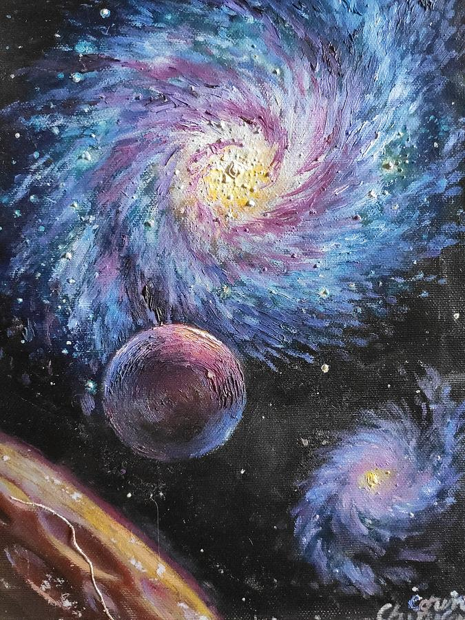

# zhsu0843_9103_tut5_Individual-_Task

# How to interact with the work
My work is a timed animation event, the circle on the canvas of the work will shrink and enlarge after a certain time, and some of the circles will also move irregularly according to the timer

# The individual approach to animating the group code
- I use time to drive my code, and the images in my work will change based on time

- In my code, the size of my circle is animated, it shrinks after a certain amount of time, and then enlarges, and the animation action of each circle is not uniform. There are also circles that move irregularly and smoothly across the canvas.

- The picture above is my inspiration, it is a galaxy, because there are many black holes and planets in the universe, so I want to use the circle and animation to simulate the abstract galaxy, the circle that keeps enlarging and shrinking is just like the gravity of the black hole, and the circle that moves around is just like the planet that keeps moving in the universe.

- My personal animation skills are based on the Week8 tutorial as a reference.

1. I use *const easing = 0.05;* to control the transition of circular changes 
2. I use *if (frameCount % 48 == 0)* to control the time of when the circle will make the next change.
3. I use *targetCircleSizes[i] = random()* to make the size of the circle change random.

- For techniques outside of the course, I used Chatgpt as an aid to help me improve the code and check for errors, as I often put mistakes in the code, such as missing codes, spelling mistakes, etc. This tool helps me quickly check and correct errors. It also helps me optimize my code to make it more logical and render better. [Chatgpt](https://chat.openai.com/)